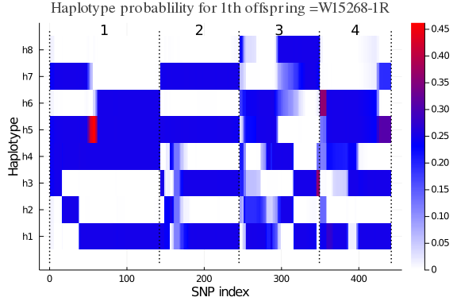
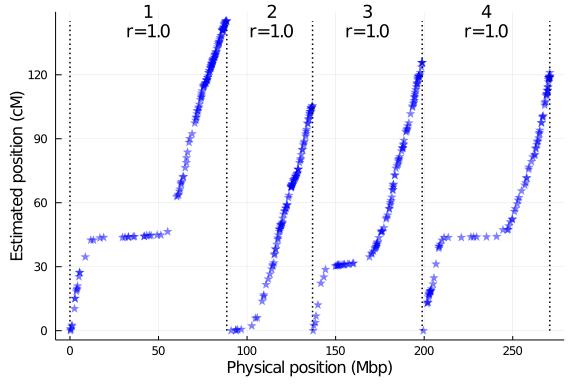

# Setup PolyOrigin

For parallel computation
~~~~{.julia}
using Distributed
addprocs(4)
@info string("nworkers=", nworkers())
@everywhere using PolyOrigin
~~~~~~~~~~~~~

Set four worker processes on local machine. See the manual
of `addprocs` for launching worker processes via the specified cluster manager
or on remote machines via SSH. The last line makes PolyOrigin avaiable on all processes.

For non-parallel computation
~~~~{.julia}
using PolyOrigin
~~~~~~~~~~~~~

# Run polyOrigin

~~~~{.julia}
cd(@__DIR__)
~~~~~~~~~~~~~

Set working directory to the direcotry of this file. Alternatively,
set keyword argument `workdir` of `polyOrigin`.

~~~~{.julia}
genofile = "TableS2_dose.csv"
pedfile = "TableS3_ped.csv"
chrsubset = 1:4
outstem = "potato_output"
~~~~~~~~~~~~~

~~~~{.julia}
@time polyancestry= polyOrigin(genofile,pedfile;
    isphysmap=true,
    recomrate=1.25,
    chrsubset=chrsubset,
    snpsubset=1:5:1000,
    isparallel=true,
    refinemap=true,
    refineorder=false,
    outstem=outstem
)
~~~~~~~~~~~~~

The keyargs `isphysmap`  and `recomrate` transform the input physical map (positions
in base pairs) into genetic map with speficied constant recombation rate. `chrsubset`
and `snpsubset` specify a subset of marker data for a fast test.  `isparallel`
specifies if computations are parallel among chromosomes, and `outstem`
specifies the stem of output files.`refinemap` and `refineorder` specify to refine
inter-marker distances but not local marker ordering.

The returned polyancestry from polyOrigin has been saved.
~~~~{.julia}
outfiles = filter(x->occursin(outstem,x), readdir())
~~~~~~~~~~~~~

~~~~
7-element Array{String,1}:
 "potato_output.log"
 "potato_output_condprob.gif"
 "potato_output_genoprob.csv"
 "potato_output_maprefined.csv"
 "potato_output_parentphased.csv"
 "potato_output_polyancestry.csv"
 "potato_output_postdoseprob.csv"
~~~~

[Click to view log file](potato_output.log)

We can read polyancestry back
~~~~{.julia}
polyancestry=readPolyAncestry(string(outstem,"_polyancestry.csv"))
~~~~~~~~~~~~~

# Visualize conditional probability

Visualize haplotype probabilities of single offspring
~~~~{.julia}
plotCondprob(polyancestry,offspring=1)
~~~~~~~~~~~~~

\ 

Visualize haplotype probabilities of all offspring
~~~~{.julia}
animCondprob(polyancestry,fps=0.5,outfile=string(outstem,"_condprob.gif"))
~~~~~~~~~~~~~

where `fps` specifies the number of frames per seconds, for exmaple, `fps=0.5`
means one figure every two seconds.

# Evaluate estimated map

Compare estimated map with input physical map
~~~~{.julia}
polygeno=readPolyGeno(genofile,pedfile,isphysmap=true)
plotMapComp(polygeno.markermap[chrsubset],polyancestry.markermap,
  xlabel="Physical position (Mbp)",
  ylabel="Estimated position (cM)"
)
~~~~~~~~~~~~~

\ 

where r is kendall rank correlation for each chromsome.
