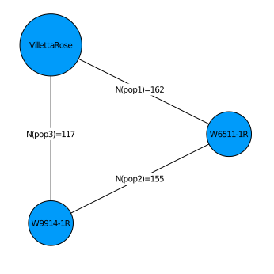

# Setup PolyOrigin

For parallel computation
~~~~{.julia}
using Distributed
addprocs(4)
@info string("nworkers=", nworkers())
@everywhere using PolyOrigin
~~~~~~~~~~~~~

Set four worker processes on local machine. See the manual
of `addprocs` for launching worker processes via the specified cluster manager
or on remote machines via SSH. The last line makes PolyOrigin avaiable on all processes.

For non-parallel computation
~~~~{.julia}
using PolyOrigin
~~~~~~~~~~~~~

# Input files

Set working directory to the direcotry of this file.
~~~~{.julia}
cd(@__DIR__)
~~~~~~~~~~~~~

Set input files and outstem
~~~~{.julia}
genofile = "TableS2_dose.csv"
pedfile = "TableS3_ped.csv"
chrsubset = 1:4
outstem = "potato_output"
~~~~~~~~~~~~~

Check input files. In the pedfile, the parents of founders are set to 0.
~~~~{.julia}
using CSV, DataFrames
show(CSV.read(pedfile,DataFrame)[1:8,:],eltypes=false)
~~~~~~~~~~~~~

~~~~
8×5 DataFrame
 Row │ individual    population  mother    father        ploidy
─────┼──────────────────────────────────────────────────────────
   1 │ W6511-1R      0           0         0                  4
   2 │ VillettaRose  0           0         0                  4
   3 │ W9914-1R      0           0         0                  4
   4 │ W15268-1R     pop1        W6511-1R  VillettaRose       4
   5 │ W15268-4R     pop1        W6511-1R  VillettaRose       4
   6 │ W15268-5R     pop1        W6511-1R  VillettaRose       4
   7 │ W15268-6R     pop1        W6511-1R  VillettaRose       4
   8 │ W15268-7R     pop1        W6511-1R  VillettaRose       4
~~~~

In the genofile, columns 1-3 denote the marker map, and rest
columns for the dosages of parents and offspring (NA denotes missing).
~~~~{.julia}
show(CSV.read(genofile,DataFrame)[1:5,1:5],eltypes=false)
~~~~~~~~~~~~~

~~~~
5×5 DataFrame
 Row │ Marker               Chrom  Position  W6511-1R  VillettaRose
─────┼──────────────────────────────────────────────────────────────
   1 │ solcap_snp_c2_36608      1    251132         2             2
   2 │ solcap_snp_c2_36658      1    269400         2             2
   3 │ solcap_snp_c1_10930      1    309342         2             2
   4 │ PotVar0120130            1    353979         2             2
   5 │ PotVar0120070            1    433801         2             2
~~~~

plot crossdesign for the 5x5 diallel cross.
~~~~{.julia}
polygeno = readPolyGeno(genofile, pedfile,isphysmap=true,recomrate=1.25)
PolyOrigin.plotdesign(polygeno)
~~~~~~~~~~~~~

\ 

# Run polyOrigin

run polyOrigin
~~~~{.julia}
@time polyancestry= polyOrigin(genofile,pedfile;
    refinemap=true,
    refineorder=false,
    isphysmap=true,
    recomrate=1.25,
    chrsubset=chrsubset,
    snpsubset=1:5:1000,
    isparallel=true,    
    outstem=outstem
)
~~~~~~~~~~~~~

The keyargs `isphysmap`  and `recomrate` transform the input physical map (positions
in base pairs) into genetic map with speficied constant recombation rate. `chrsubset`
and `snpsubset` specify a subset of marker data for a fast test.  `isparallel`
specifies if computations are parallel among chromosomes, and `outstem`
specifies the stem of output files.`refinemap` and `refineorder` specify to refine
inter-marker distances but not local marker ordering.

The returned polyancestry from polyOrigin has been saved.

~~~~{.julia}
outfiles = filter(x->occursin(outstem,x), readdir())
~~~~~~~~~~~~~

~~~~
7-element Array{String,1}:
 "potato_output.log"
 "potato_output_genoprob.csv"
 "potato_output_maprefined.csv"
 "potato_output_parentphased.csv"
 "potato_output_parentphased_corrected.csv"
 "potato_output_polyancestry.csv"
 "potato_output_postdoseprob.csv"
~~~~

[Click to view log file](potato_output.log)

# Check output

The main output file constains multiple dataframes.
~~~~{.julia}
ancestryfile = outstem*"_polyancestry.csv"
res = PolyOrigin.readdlm2dict(ancestryfile)
keys(res)
~~~~~~~~~~~~~

~~~~
Base.KeySet for a Dict{SubString{String},DataFrames.DataFrame} with 10 entr
ies. Keys:
  "parentinfo"
  "offspringinfo"
  "valentprob"
  "ancestralgenotype"
  "correction"
  "designinfo"
  "genoprob"
  "valentlist"
  "delmarker"
  "parentgeno"
~~~~

The parentgeno dataframe. At each marker for each parent, the phased parental
genotype is given by e.g. 1|2|2|1, where 1 and 2 denote the two alleles.
~~~~{.julia}
show(res["parentgeno"][1:10:100,1:5],eltypes=false)
~~~~~~~~~~~~~

~~~~
10×5 DataFrame
 Row │ marker               chromosome  position  W6511-1R  VillettaRose
─────┼───────────────────────────────────────────────────────────────────
   1 │ solcap_snp_c2_36608           1      0.0   1|2|2|1   2|2|1|1
   2 │ PotVar0045435                 1     21.87  1|2|1|2   1|1|1|2
   3 │ PotVar0122551                 1     44.95  1|1|1|2   2|2|1|2
   4 │ PotVar0095169                 1     45.96  1|1|1|2   2|2|1|2
   5 │ solcap_snp_c2_41364           1     70.1   2|2|1|2   1|2|1|1
   6 │ PotVar0043815                 1     96.44  1|1|2|1   1|2|1|1
   7 │ solcap_snp_c2_20005           1    110.09  1|1|1|2   1|1|1|2
   8 │ solcap_snp_c1_5346            1    118.92  2|2|2|1   1|2|1|1
   9 │ solcap_snp_c2_2220            1    122.62  1|2|2|2   1|2|2|2
  10 │ solcap_snp_c2_7269            1    128.02  1|2|2|2   1|2|1|2
~~~~

The genoprob dataframe. At each marker for each offspring, the posterior probability
distribution is given by e.g. 57|87=>0.336|0.664, meaning that the posterior
probabilities of ancestral genotypes 57 and 87 are 0.336 and 0.664, respectively.
~~~~{.julia}
show(res["genoprob"][1:10:100,1:4],eltypes=false)
~~~~~~~~~~~~~

~~~~
10×4 DataFrame
 Row │ marker               chromosome  position  W15268-1R                
    ⋯
─────┼─────────────────────────────────────────────────────────────────────
─────
   1 │ solcap_snp_c2_36608           1      0.0   1|2|13|14|16|17|23|24|27|
31| ⋯
   2 │ PotVar0045435                 1     21.87  14|17|19|34|37|54|61|62=>
0.9
   3 │ PotVar0122551                 1     44.95  34|64=>0.001|0.999
   4 │ PotVar0095169                 1     45.96  64=>1.0
   5 │ solcap_snp_c2_41364           1     70.1   51|54|59|60=>0.005|0.99|0
.00 ⋯
   6 │ PotVar0043815                 1     96.44  51|53|54|59|60|81|84=>0.4
86|
   7 │ solcap_snp_c2_20005           1    110.09  51|52|53=>0.344|0.653|0.0
02
   8 │ solcap_snp_c1_5346            1    118.92  52=>1.0
   9 │ solcap_snp_c2_2220            1    122.62  52=>1.0                  
    ⋯
  10 │ solcap_snp_c2_7269            1    128.02  52|62=>0.995|0.004
                                                                1 column om
itted
~~~~

The ancestral genotypes are defined for each sub-population in the following.
The columns state and stateindex denote the ancestral genotypes.
~~~~{.julia}
show(res["ancestralgenotype"][sort(rand(1:100,10)),:],eltypes=false)
~~~~~~~~~~~~~

~~~~
10×5 DataFrame
 Row │ population  parentindex  parent                 stateindex  state
─────┼─────────────────────────────────────────────────────────────────────
   1 │ pop1        1|2          W6511-1R|VillettaRose           4  1-1-5-8
   2 │ pop1        1|2          W6511-1R|VillettaRose          11  1-2-5-5
   3 │ pop1        1|2          W6511-1R|VillettaRose          21  1-3-5-5
   4 │ pop1        1|2          W6511-1R|VillettaRose          30  1-3-8-8
   5 │ pop1        1|2          W6511-1R|VillettaRose          41  2-2-5-5
   6 │ pop1        1|2          W6511-1R|VillettaRose          57  2-3-6-8
   7 │ pop1        1|2          W6511-1R|VillettaRose          85  3-4-6-6
   8 │ pop1        1|2          W6511-1R|VillettaRose          94  4-4-5-8
   9 │ pop1        1|2          W6511-1R|VillettaRose          96  4-4-6-7
  10 │ pop1        1|2          W6511-1R|VillettaRose          99  4-4-7-8
~~~~

where 1-4 denote the homologs in the first parent, and 5-8 for the second parent.

The valentprob dataframe. For each offpsring in each chromosome, the valent is
given eg. 1:3-2:4&5:8-6:7|1:3-2:4&5:6:7:8 where & delimits the valent configurations
between two parents, and |  delimits each possible combination of valent configurations.
The column valentprob gives the full posterior probabilties.
~~~~{.julia}
println(join(names(res["valentprob"])[[1,2,5,7]],", "))
println(join(Vector(res["valentprob"][1,[1,2,5,7]]),", "))
~~~~~~~~~~~~~

~~~~
chromosome, individual, valent, valentprob
1, W15268-1R, 1:2:3:4&5:6:7:8|1:2:3:4&5:7-6:8|1:2-3:4&5:6:7:8|1:2-3:4&5:7-6
:8, 0.8875|0.1048|0.0072|0.0005
~~~~

# Relative frequencies of valent configurations

We can read polyancestry
~~~~{.julia}
polyancestry = readPolyAncestry(outstem*"_polyancestry.csv")
~~~~~~~~~~~~~

Relative frequencies of bi- or quadri-valent formations for each parent in
each chromosome
~~~~{.julia}
valentfreq = calvalentfreq(polyancestry)
~~~~~~~~~~~~~

~~~~
12×6 DataFrame
 Row │ chromosome  parent        1:2-3:4  1:3-2:4  1:4-2:3  1:2:3:4
     │ String      String        Float64  Float64  Float64  Float64
─────┼──────────────────────────────────────────────────────────────
   1 │ 1           W6511-1R       0.2397   0.2587   0.2776   0.224
   2 │ 1           VillettaRose   0.2294   0.2222   0.2688   0.2796
   3 │ 1           W9914-1R       0.2169   0.1875   0.2831   0.3125
   4 │ 2           W6511-1R       0.2271   0.3028   0.306    0.164
   5 │ 2           VillettaRose   0.2222   0.4122   0.1864   0.1792
   6 │ 2           W9914-1R       0.1838   0.3199   0.2426   0.2537
   7 │ 3           W6511-1R       0.2934   0.2555   0.3123   0.1388
   8 │ 3           VillettaRose   0.2366   0.2796   0.3154   0.1685
   9 │ 3           W9914-1R       0.2059   0.3493   0.2537   0.1912
  10 │ 4           W6511-1R       0.2681   0.2429   0.3628   0.1262
  11 │ 4           VillettaRose   0.2581   0.2832   0.2688   0.19
  12 │ 4           W9914-1R       0.2757   0.261    0.2721   0.1912
~~~~

plot the relative frequences averaging overage chromosomes/parents
~~~~{.julia}
plotvalentfreq(valentfreq)
~~~~~~~~~~~~~

\ 

where 1:2:3:4 denotes quadrivalent formation and the others for bivalent formations

# Visualize conditional probability

Visualize haplotype probabilities of single offspring
~~~~{.julia}
plotCondprob(polyancestry,offspring=1)
~~~~~~~~~~~~~

\ 

Visualize haplotype probabilities of all offspring
~~~~{.julia}
animCondprob(polyancestry,fps=0.5,outfile=string(outstem,"_condprob.gif"))
~~~~~~~~~~~~~

where `fps` specifies the number of frames per seconds, for exmaple, `fps=0.5`
means one figure every two seconds.

# Evaluate estimated map

Compare estimated map with input physical map
~~~~{.julia}
polygeno=readPolyGeno(genofile,pedfile,isphysmap=true)
plotMapComp(polygeno.markermap[chrsubset],polyancestry.markermap,
  xlabel="Physical position (Mbp)",
  ylabel="Estimated position (cM)"
)
~~~~~~~~~~~~~

\ 

where r is kendall rank correlation for each chromsome.
