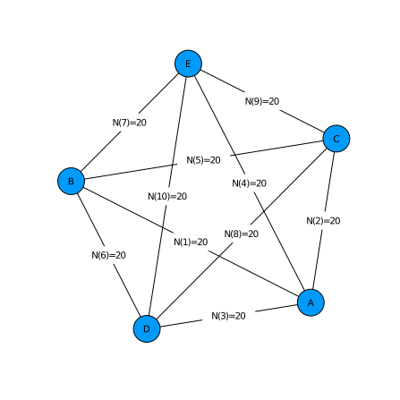
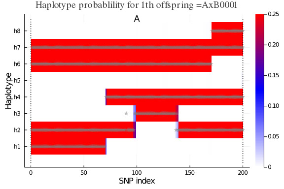
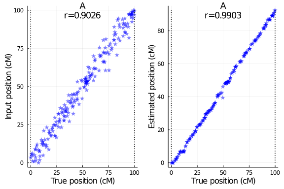

# Setup PolyOrigin

Non-parallel computation for simulated data with one linkage group
~~~~{.julia}
using PolyOrigin
~~~~~~~~~~~~~

# Run polyOrigin

~~~~{.julia}
cd(@__DIR__)
~~~~~~~~~~~~~

Set working directory to the direcotry of this file.

~~~~{.julia}
dataid = "tetraploid_simarray"
genofile = string(dataid,"_geno_disturbed.csv")
pedfile = string(dataid,"_ped.csv")
outstem = string(dataid,"_output")
~~~~~~~~~~~~~

plot crossdesign for the 5x5 diallel cross with 10 F1 populations of size 20.
~~~~{.julia}
polygeno = readPolyGeno(genofile, pedfile)
PolyOrigin.plotdesign(polygeno)
~~~~~~~~~~~~~

\ 

run polyOrigin
~~~~{.julia}
@time polyancestry= polyOrigin(polygeno;
    refinemap=true,
    refineorder=true,
    outstem=outstem
)
~~~~~~~~~~~~~

Keyargs `refinemap` and `refineorder` specify to refine inter-marker distances
and local marker ordering, and `outstem` specifies the stem of output files.

The returned polyancestry from polyOrigin has been saved.
~~~~{.julia}
outfiles = filter(x->occursin(outstem,x), readdir())
~~~~~~~~~~~~~

~~~~
8-element Array{String,1}:
 "tetraploid_simarray_output.log"
 "tetraploid_simarray_output_condprob.gif"
 "tetraploid_simarray_output_genoprob.csv"
 "tetraploid_simarray_output_maprefined.csv"
 "tetraploid_simarray_output_parentphased.csv"
 "tetraploid_simarray_output_parentphased_corrected.csv"
 "tetraploid_simarray_output_polyancestry.csv"
 "tetraploid_simarray_output_postdoseprob.csv"
~~~~

[Click to view log file](tetraploid_simarray_output.log)

We can read polyancestry back
~~~~{.julia}
polyancestry = readPolyAncestry(string(outstem,"_genoprob.csv"),pedfile)
~~~~~~~~~~~~~

# Calculate estimation error probability

Read true value file used in simulating data
~~~~{.julia}
truegeno = readTruegeno!(string(dataid,"_true.csv"), polyancestry)
keys(truegeno)
~~~~~~~~~~~~~

~~~~
(:truemap, :estmap, :parentgeno, :offspringgeno)
~~~~

where the absolute phase of `polyancestry.parentgeno` is set to be consistent
with that of `truegeno.parentgeno`, and `polyancestry.genoprob` and
`polyancestry.haploprob` are re-ordered accordingly, and
* `:truemap` = true genetic map,
* `:estmap` = estimated genetic map resulting from map refinement,
* `:parentgeno` = true phased paental genotypes,
* `:offspringgeno` = true parental origins.

~~~~{.julia}
acc=calAccuracy!(truegeno,polyancestry)
~~~~~~~~~~~~~

~~~~
(ndoseerr = 0, nphaseerr = 0, nalleleerr = 0, nparentgeno = 1000, assignerr
 = 0.0219604, callerr = 0.017625, delfraction = 0.0)
~~~~

where
* `ndoseerr` = number of wrongly estimated parental dosages,
* `nphaseerr` = number of wrongly estimated parental phases,
* `nalleleerr` = number of wrongly estimated alleles for  parental phased genotypes,
* `nparentgeno` = total number of parental genotypes,
* `assignerr` = one minus probability of true unphased origin-genotype,
* `callerr` = fraction of unphased origin-genotypes being wrongly called,
* `delfraction` = fraction of markers being deleted.

# Visualize conditional probability

Visualize haplotype probabilities of single offspring
~~~~{.julia}
plotCondprob(polyancestry,truegeno=truegeno,offspring=1)
~~~~~~~~~~~~~

\ 

Visualize haplotype probabilities of all offspring
~~~~{.julia}
animCondprob(polyancestry,truegeno=truegeno,fps=0.5,
  outfile="tetraploid_simarray_output_condprob.gif")
~~~~~~~~~~~~~

where `fps` specifies the number of frames per seconds, for exmaple, `fps=0.5`
means one figure every two seconds.

# Evaluate estimated map

Compare input map and estimated map with true map
~~~~{.julia}
using Plots
polygeno=readPolyGeno(genofile,pedfile)
fig = plotMapComp(truegeno.truemap,polygeno.markermap,
    xlabel="True position (cM)",
    ylabel="Input position (cM)")
fig2 = plotMapComp(truegeno.truemap, polyancestry.markermap,
    xlabel="True position (cM)",
    ylabel="Estimated position (cM)")
plot(fig,fig2)
~~~~~~~~~~~~~

\ 

where r is the Kendall rank correlation between true map and comparing map.
