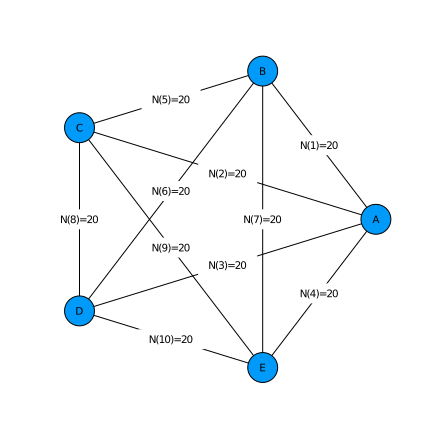
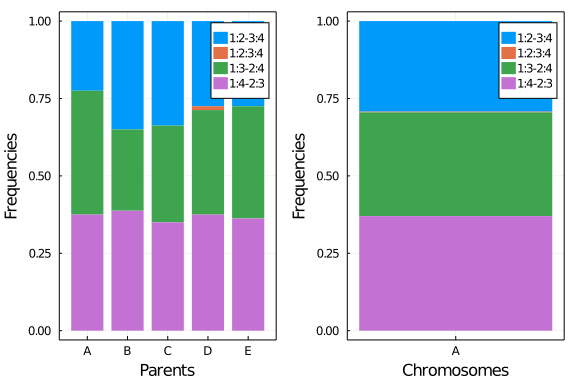

# Setup PolyOrigin

Non-parallel computation for simulated data with one linkage group
~~~~{.julia}
using PolyOrigin
~~~~~~~~~~~~~

# Input files
Set working directory to the direcotry of this file.
~~~~{.julia}
cd(@__DIR__)
~~~~~~~~~~~~~

Set input files and outstem
~~~~{.julia}
dataid = "tetraploid_simarray"
genofile = string(dataid,"_geno_disturbed.csv")
pedfile = string(dataid,"_ped.csv")
outstem = string(dataid,"_output")
~~~~~~~~~~~~~

Check input files. In the pedfile, the parents of founders are set to 0.
~~~~{.julia}
using CSV, DataFrames
show(CSV.read(pedfile,DataFrame)[1:8,:],eltypes=false)
~~~~~~~~~~~~~

~~~~
8×5 DataFrame
 Row │ Individual    Population    MotherID    FatherID    Ploidy
─────┼────────────────────────────────────────────────────────────
   1 │ A                       0   0           0                4
   2 │ B                       0   0           0                4
   3 │ C                       0   0           0                4
   4 │ D                       0   0           0                4
   5 │ E                       0   0           0                4
   6 │ AxB0001                 1   A           B                4
   7 │ AxB0002                 1   A           B                4
   8 │ AxB0003                 1   A           B                4
~~~~

In the genofile, columns 1-3 denote the marker map, and rest
columns for the dosages of parents and offspring (NA denotes missing).
~~~~{.julia}
show(CSV.read(genofile,DataFrame)[1:5,1:10],eltypes=false)
~~~~~~~~~~~~~

~~~~
5×10 DataFrame
 Row │ marker  chromosome  position  A   B  C  D  E  AxB0001  AxB0002
─────┼────────────────────────────────────────────────────────────────
   1 │ A_0015  A               0.0   1   1  1  2  3  1        2
   2 │ A_0006  A               0.83  2   1  0  2  1  2        1
   3 │ A_0005  A               1.04  NA  2  3  3  2  1        1
   4 │ A_0011  A               1.53  3   1  2  4  3  3        2
   5 │ A_0018  A               1.79  0   1  2  2  1  0        1
~~~~

plot crossdesign for the 5x5 diallel cross.
~~~~{.julia}
polygeno = readPolyGeno(genofile, pedfile)
PolyOrigin.plotdesign(polygeno;method=:circular)
~~~~~~~~~~~~~

\ 

# Run polyOrigin

run polyOrigin
~~~~{.julia}
@time polyancestry= polyOrigin(genofile,pedfile;
    refinemap=true,
    refineorder=true,
    isphysmap=false,
    outstem=outstem
)
~~~~~~~~~~~~~

Keyargs `refinemap` and `refineorder` specify to refine inter-marker distances
and local marker ordering, `isphysmap = fase` specifies that the input map is
genetic map,  and `outstem` specifies the stem of output files.

The returned polyancestry from polyOrigin has been saved.

~~~~{.julia}
outfiles = filter(x->occursin(outstem,x), readdir())
~~~~~~~~~~~~~

~~~~
7-element Array{String,1}:
 "tetraploid_simarray_output.log"
 "tetraploid_simarray_output_genoprob.csv"
 "tetraploid_simarray_output_maprefined.csv"
 "tetraploid_simarray_output_parentphased.csv"
 "tetraploid_simarray_output_parentphased_corrected.csv"
 "tetraploid_simarray_output_polyancestry.csv"
 "tetraploid_simarray_output_postdoseprob.csv"
~~~~

[Click to view log file](tetraploid_simarray_output.log)

# Check output

The main output file constains multiple dataframes.
~~~~{.julia}
ancestryfile = outstem*"_polyancestry.csv"
res = PolyOrigin.readdlm2dict(ancestryfile)
keys(res)
~~~~~~~~~~~~~

~~~~
Base.KeySet for a Dict{SubString{String},DataFrame} with 10 entries. Keys:
  "parentinfo"
  "offspringinfo"
  "valentprob"
  "ancestralgenotype"
  "correction"
  "designinfo"
  "genoprob"
  "valentlist"
  "delmarker"
  "parentgeno"
~~~~

The parentgeno dataframe. At each marker for each parent, the phased parental
genotype is given by e.g. 1|2|2|1, where 1 and 2 denote the two alleles.
~~~~{.julia}
show(res["parentgeno"][1:10:100,1:6],eltypes=false)
~~~~~~~~~~~~~

~~~~
10×6 DataFrame
 Row │ marker  chromosome  position  A        B        C
─────┼─────────────────────────────────────────────────────────
   1 │ A_0017  A               0.0   2|2|2|2  2|2|2|2  1|2|1|2
   2 │ A_0003  A               0.48  2|1|2|2  1|2|2|2  1|2|1|2
   3 │ A_0022  A               4.38  2|1|2|2  2|1|2|1  1|2|1|1
   4 │ A_0030  A               9.6   2|2|2|2  2|2|1|2  2|1|2|2
   5 │ A_0041  A              14.74  1|2|2|2  2|1|1|1  1|2|2|1
   6 │ A_0051  A              19.5   1|1|2|1  1|2|1|2  2|1|2|1
   7 │ A_0061  A              22.36  2|2|2|2  1|2|2|1  1|1|1|2
   8 │ A_0071  A              27.45  2|2|2|2  2|2|2|2  1|2|1|2
   9 │ A_0080  A              31.31  1|1|1|1  2|1|1|2  2|1|2|2
  10 │ A_0091  A              37.61  1|1|1|1  2|2|2|2  2|1|2|1
~~~~

The genoprob dataframe. At each marker for each offspring, the posterior probability
distribution is given by e.g. 57|87=>0.336|0.664, meaning that the posterior
probabilities of ancestral genotypes 57 and 87 are 0.336 and 0.664, respectively.
~~~~{.julia}
show(res["genoprob"][1:10:100,1:4],eltypes=false)
~~~~~~~~~~~~~

~~~~
10×4 DataFrame
 Row │ marker  chromosome  position  AxB0001
─────┼─────────────────────────────────────────────────────────────────
   1 │ A_0017  A               0.0   24|26|29|39|59=>0.004|0.004|0.98…
   2 │ A_0003  A               0.48  29=>1.0
   3 │ A_0022  A               4.38  29=>1.0
   4 │ A_0030  A               9.6   29=>1.0
   5 │ A_0041  A              14.74  29=>1.0
   6 │ A_0051  A              19.5   29=>1.0
   7 │ A_0061  A              22.36  29=>1.0
   8 │ A_0071  A              27.45  29|39=>0.328|0.671
   9 │ A_0080  A              31.31  39=>1.0
  10 │ A_0091  A              37.61  39|69=>0.999|0.001
~~~~

The ancestral genotypes are defined for each sub-population in the following.
The columns state and stateindex denote the ancestral genotypes.
~~~~{.julia}
show(res["ancestralgenotype"][sort(rand(1:100,10)),:],eltypes=false)
~~~~~~~~~~~~~

~~~~
10×5 DataFrame
 Row │ population  parentindex  parent  stateindex  state
─────┼──────────────────────────────────────────────────────
   1 │          1  1|2          A|B              9  1-1-7-8
   2 │          1  1|2          A|B             14  1-2-5-8
   3 │          1  1|2          A|B             21  1-3-5-5
   4 │          1  1|2          A|B             30  1-3-8-8
   5 │          1  1|2          A|B             35  1-4-6-6
   6 │          1  1|2          A|B             46  2-2-6-7
   7 │          1  1|2          A|B             76  3-3-6-7
   8 │          1  1|2          A|B             77  3-3-6-8
   9 │          1  1|2          A|B             88  3-4-7-7
  10 │          1  1|2          A|B             93  4-4-5-7
~~~~

where 1-4 denote the homologs in the first parent, and 5-8 for the second parent.

The valentprob dataframe. For each offpsring in each chromosome, the valent is
given eg. 1:3-2:4&5:8-6:7|1:3-2:4&5:6:7:8 where & delimits the valent configurations
between two parents, and |  delimits each possible combination of valent configurations.
The column valentprob gives the full posterior probabilties.
~~~~{.julia}
println(join(names(res["valentprob"])[[1,2,5,7]],", "))
println(join(Vector(res["valentprob"][1,[1,2,5,7]]),", "))
~~~~~~~~~~~~~

~~~~
chromosome, individual, valent, valentprob
A, AxB0001, 1:2-3:4&5:7-6:8|1:2-3:4&5:6:7:8|1:2:3:4&5:7-6:8|1:2:3:4&5:6:7:8
, 0.8382|0.1425|0.0165|0.0028
~~~~

# Relative frequencies of valent configurations

We can read polyancestry
~~~~{.julia}
polyancestry = readPolyAncestry(outstem*"_polyancestry.csv")
~~~~~~~~~~~~~

Relative frequencies of bi- or quadri-valent formations for each parent in
each chromosome
~~~~{.julia}
valentfreq = calvalentfreq(polyancestry)
~~~~~~~~~~~~~

~~~~
5×6 DataFrame
 Row │ chromosome  parent  1:2-3:4  1:3-2:4  1:4-2:3  1:2:3:4
     │ String      String  Float64  Float64  Float64  Float64
─────┼────────────────────────────────────────────────────────
   1 │ A           A        0.225    0.4      0.375    0.0
   2 │ A           B        0.35     0.2625   0.3875   0.0
   3 │ A           C        0.3375   0.3125   0.35     0.0
   4 │ A           D        0.275    0.3375   0.375    0.0125
   5 │ A           E        0.275    0.3625   0.3625   0.0
~~~~

plot the relative frequences averaging overage chromosomes/parents
~~~~{.julia}
plotvalentfreq(valentfreq)
~~~~~~~~~~~~~

\ 

where 1:2:3:4 denotes quadrivalent formation and the others for bivalent formations

# Calculate estimation error probability

**_NOTE_**
    It works only with simulate data, since the truevalue file does not exist
    for real data.

Read the truevalue file used in simulating data
~~~~{.julia}
truegeno = readTruegeno!(string(dataid,"_true.csv"), polyancestry)
keys(truegeno)
~~~~~~~~~~~~~

~~~~
(:truemap, :estmap, :parentgeno, :offspringgeno)
~~~~

where the absolute phase of `polyancestry.parentgeno` is set to be consistent
with that of `truegeno.parentgeno`, and `polyancestry.genoprob` and
`polyancestry.haploprob` are re-ordered accordingly, and
* `:truemap` = true genetic map,
* `:estmap` = estimated genetic map resulting from map refinement,
* `:parentgeno` = true phased paental genotypes,
* `:offspringgeno` = true parental origins.

~~~~{.julia}
acc=calAccuracy!(truegeno,polyancestry)
~~~~~~~~~~~~~

~~~~
(ndoseerr = 0, nphaseerr = 0, nalleleerr = 0, nparentgeno = 1000, assignerr
 = 0.0234811, callerr = 0.019725, delfraction = 0.0)
~~~~

where
* `ndoseerr` = number of wrongly estimated parental dosages,
* `nphaseerr` = number of wrongly estimated parental phases,
* `nalleleerr` = number of wrongly estimated alleles for  parental phased genotypes,
* `nparentgeno` = total number of parental genotypes,
* `assignerr` = one minus probability of true unphased origin-genotype,
* `callerr` = fraction of unphased ancestral genotypes being wrongly called,
* `delfraction` = fraction of markers being deleted.

# Visualize conditional probability

**_NOTE_**
    For simulate data, keep the default keyarg `truegeno=nothing`.

Visualize haplotype probabilities of single offspring, crosses `x` denoting
true values.
~~~~{.julia}
plotCondprob(polyancestry,truegeno=truegeno,offspring=1)
~~~~~~~~~~~~~

\ 

Visualize haplotype probabilities of all offspring
~~~~{.julia}
animCondprob(polyancestry,truegeno=truegeno,fps=0.5,
  outfile=outstem*"_condprob.gif")
~~~~~~~~~~~~~

where `fps` specifies the number of frames per seconds, for exmaple, `fps=0.5`
means one figure every two seconds.

# Evaluate estimated map

Compare input map and estimated map with true map
~~~~{.julia}
using Plots
polygeno=readPolyGeno(genofile,pedfile)
fig = plotMapComp(truegeno.truemap,polygeno.markermap,
    xlabel="True position (cM)",
    ylabel="Input position (cM)")
fig2 = plotMapComp(truegeno.truemap, polyancestry.markermap,
    xlabel="True position (cM)",
    ylabel="Estimated position (cM)")
plot(fig,fig2)
~~~~~~~~~~~~~

\ 

where r is the Kendall rank correlation between true map and comparing map.
