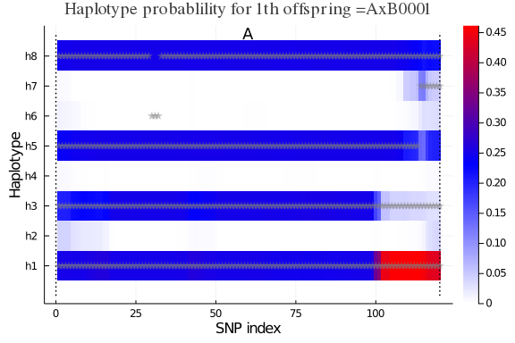

# Setup PolyOrigin

Non-parallel computation for simulated data with one linkage group
~~~~{.julia}
using PolyOrigin
~~~~~~~~~~~~~

# Run polyOrigin

~~~~{.julia}
cd(@__DIR__)
~~~~~~~~~~~~~

Set working directory to the direcotry of this file.

~~~~{.julia}
dataid = "tetraploid_simgbs"
genofile = string(dataid,"_geno.csv")
pedfile = string(dataid,"_ped.csv")
outstem = string(dataid,"_output")
~~~~~~~~~~~~~

~~~~{.julia}
@time polyancestry= polyOrigin(genofile, pedfile; outstem)
~~~~~~~~~~~~~

Keyargs `refinemap` and `refineorder` specify to refine inter-marker distances
and local marker ordering. `outstem` specifies the stem of output files.

The returned polyancestry from polyOrigin has been saved.
~~~~{.julia}
outfiles = filter(x->occursin(outstem,x), readdir())
~~~~~~~~~~~~~

~~~~
6-element Array{String,1}:
 "tetraploid_simgbs_output.log"
 "tetraploid_simgbs_output_condprob.gif"
 "tetraploid_simgbs_output_genoprob.csv"
 "tetraploid_simgbs_output_parentphased.csv"
 "tetraploid_simgbs_output_polyancestry.csv"
 "tetraploid_simgbs_output_postdoseprob.csv"
~~~~

[Click to view log file](tetraploid_simgbs_output.log)

We can read polyancestry back
~~~~{.julia}
polyancestry = readPolyAncestry(string(outstem, "_polyancestry.csv"))
~~~~~~~~~~~~~

# Calculate estimation error probability

Read true value file used in simulating data
~~~~{.julia}
truegeno=readTruegeno!(string(dataid,"_true.csv"),polyancestry)
keys(truegeno)
~~~~~~~~~~~~~

~~~~
(:truemap, :estmap, :parentgeno, :offspringgeno)
~~~~

where the absolute phase of `polyancestry.parentgeno` is set to be consistent
with that of `truegeno.parentgeno`, and `polyancestry.genoprob` and
`polyancestry.haploprob` are re-ordered accordingly, and
* `:truemap` = true genetic map,
* `:estmap` = estimated genetic map resulting from map refinement,
* `:parentgeno` = true phased paental genotypes,
* `:offspringgeno` = true parental origins.

~~~~{.julia}
acc=calAccuracy!(truegeno,polyancestry)
~~~~~~~~~~~~~

~~~~
(ndoseerr = 11, nphaseerr = 11, nalleleerr = 11, nparentgeno = 600, assigne
rr = 0.156757, callerr = 0.112042, delfraction = 0.0)
~~~~

where
* `ndoseerr` = number of wrongly estimated parental dosages,
* `nphaseerr` = number of wrongly estimated parental phases,
* `nalleleerr` = number of wrongly estimated alleles for  parental phased genotypes,
* `nparentgeno` = total number of parental genotypes,
* `assignerr` = one minus probability of true unphased origin-genotype,
* `callerr` = fraction of unphased origin-genotypes being wrongly called,
* `delfraction` = fraction of markers being deleted.

# Visualize conditional probability

Visualize haplotype probabilities of single offspring
~~~~{.julia}
plotCondprob(polyancestry,truegeno=truegeno,offspring=1)
~~~~~~~~~~~~~

\ 

Visualize haplotype probabilities of all offspring
~~~~{.julia}
animCondprob(polyancestry,truegeno=truegeno, fps=0.5,
  outfile="tetraploid_simgbs_output_condprob.gif")
~~~~~~~~~~~~~

where `fps` specifies the number of frames per seconds, for exmaple, `fps=0.5`
means one figure every two seconds.
