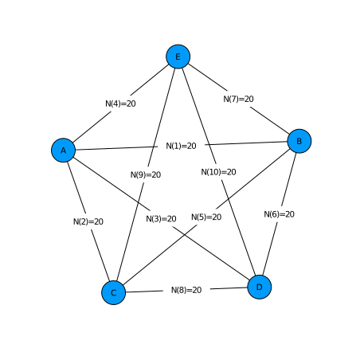

# Setup PolyOrigin

Non-parallel computation for simulated data with one linkage group
~~~~{.julia}
using PolyOrigin
~~~~~~~~~~~~~

# Input files

Set working directory to the direcotry of this file.
~~~~{.julia}
cd(@__DIR__)
~~~~~~~~~~~~~

Set input files and outstem
~~~~{.julia}
dataid = "tetraploid_simgbs"
genofile = string(dataid,"_geno.csv")
pedfile = string(dataid,"_ped.csv")
outstem = string(dataid,"_output")
~~~~~~~~~~~~~

Check input files. In the pedfile, the parents of founders are set to 0.
~~~~{.julia}
using CSV, DataFrames
show(CSV.read(pedfile,DataFrame)[1:8,:],eltypes=false)
~~~~~~~~~~~~~

~~~~
8×5 DataFrame
 Row │ Individual    Population    MotherID    FatherID    Ploidy
─────┼────────────────────────────────────────────────────────────
   1 │ A                       0   0           0                4
   2 │ B                       0   0           0                4
   3 │ C                       0   0           0                4
   4 │ D                       0   0           0                4
   5 │ E                       0   0           0                4
   6 │ AxB0001                 1   A           B                4
   7 │ AxB0002                 1   A           B                4
   8 │ AxB0003                 1   A           B                4
~~~~

In the genofile, columns 1-3 denote the marker map, and rest
columns for the read counts of parents and offspring.
~~~~{.julia}
show(CSV.read(genofile,DataFrame)[1:5,1:6],eltypes=false)
~~~~~~~~~~~~~

~~~~
5×6 DataFrame
 Row │ marker    chromosome    position    A       B       C
─────┼───────────────────────────────────────────────────────────
   1 │ A_0001    A                  0.0    16|6    18|8    8|9
   2 │ A_0002    A                  1.94   0|22    6|14    0|21
   3 │ A_0003    A                  2.04   8|22    8|10    5|21
   4 │ A_0004    A                  2.2    19|4    12|8    1|15
   5 │ A_0005    A                  4.94   1|17    2|16    17|0
~~~~

plot crossdesign for the 5x5 diallel cross.
~~~~{.julia}
polygeno = readPolyGeno(genofile, pedfile)
PolyOrigin.plotdesign(polygeno)
~~~~~~~~~~~~~

\ 

# Run polyOrigin

run polyOrigin
~~~~{.julia}
@time polyancestry= polyOrigin(genofile, pedfile; outstem)
~~~~~~~~~~~~~

Keyarg `outstem` specifies the stem of output files.

The returned polyancestry from polyOrigin has been saved.

~~~~{.julia}
outfiles = filter(x->occursin(outstem,x), readdir())
~~~~~~~~~~~~~

~~~~
5-element Array{String,1}:
 "tetraploid_simgbs_output.log"
 "tetraploid_simgbs_output_genoprob.csv"
 "tetraploid_simgbs_output_parentphased.csv"
 "tetraploid_simgbs_output_polyancestry.csv"
 "tetraploid_simgbs_output_postdoseprob.csv"
~~~~

[Click to view log file](tetraploid_simgbs_output.log)

# Check output

The main output file constains multiple dataframes.
~~~~{.julia}
ancestryfile = outstem*"_polyancestry.csv"
res = PolyOrigin.readdlm2dict(ancestryfile)
keys(res)
~~~~~~~~~~~~~

~~~~
Base.KeySet for a Dict{SubString{String},DataFrame} with 10 entries. Keys:
  "parentinfo"
  "offspringinfo"
  "valentprob"
  "ancestralgenotype"
  "correction"
  "designinfo"
  "genoprob"
  "valentlist"
  "delmarker"
  "parentgeno"
~~~~

The parentgeno dataframe. At each marker for each parent, the phased parental
genotype is given by e.g. 1|2|2|1, where 1 and 2 denote the two alleles.
~~~~{.julia}
show(res["parentgeno"][1:10:100,1:6],eltypes=false)
~~~~~~~~~~~~~

~~~~
10×6 DataFrame
 Row │ marker  chromosome  position  A        B        C
─────┼─────────────────────────────────────────────────────────
   1 │ A_0001  A               0.0   2|1|1|1  2|2|1|1  2|2|1|1
   2 │ A_0011  A               8.08  2|1|1|1  1|1|1|2  1|1|1|2
   3 │ A_0021  A              12.56  2|1|2|1  1|1|1|2  2|2|1|2
   4 │ A_0031  A              19.64  1|2|2|2  2|1|1|2  1|1|1|2
   5 │ A_0041  A              25.65  2|2|1|1  2|1|2|2  2|1|1|2
   6 │ A_0051  A              36.6   2|2|1|2  1|2|1|2  2|2|2|2
   7 │ A_0061  A              43.9   2|2|1|1  2|2|1|1  1|1|2|2
   8 │ A_0071  A              57.17  2|1|1|2  2|1|2|1  1|2|2|2
   9 │ A_0081  A              66.28  1|2|1|2  1|2|2|2  1|1|2|2
  10 │ A_0091  A              75.46  1|1|1|2  1|1|1|1  1|2|1|2
~~~~

The genoprob dataframe. At each marker for each offspring, the posterior probability
distribution is given by e.g. 57|87=>0.336|0.664, meaning that the posterior
probabilities of ancestral genotypes 57 and 87 are 0.336 and 0.664, respectively.
~~~~{.julia}
show(res["genoprob"][1:10:100,1:4],eltypes=false)
~~~~~~~~~~~~~

~~~~
10×4 DataFrame
 Row │ marker  chromosome  position  AxB0001
─────┼─────────────────────────────────────────────────────────────────
   1 │ A_0001  A               0.0   6|13|14|16|17|23|24|26|27|33|34|…
   2 │ A_0011  A               8.08  23|26|36|86=>0.175|0.798|0.011|0…
   3 │ A_0021  A              12.56  26|27=>0.994|0.006
   4 │ A_0031  A              19.64  16|23|26|27|56|86=>0.001|0.027|0…
   5 │ A_0041  A              25.65  16|23|24|26|28|29|33|53=>0.001|0…
   6 │ A_0051  A              36.6   23|26=>0.023|0.975
   7 │ A_0061  A              43.9   6|22|23|26|27|36|56=>0.001|0.002…
   8 │ A_0071  A              57.17  16|22|23|25|26|27|36|52|53|56|57…
   9 │ A_0081  A              66.28  16|26|56|76=>0.005|0.932|0.056|0…
  10 │ A_0091  A              75.46  26|27|76=>0.997|0.001|0.001
~~~~

The ancestral genotypes are defined for each sub-population in the following.
The columns state and stateindex denote the ancestral genotypes.
~~~~{.julia}
show(res["ancestralgenotype"][sort(rand(1:100,10)),:],eltypes=false)
~~~~~~~~~~~~~

~~~~
10×5 DataFrame
 Row │ population  parentindex  parent  stateindex  state
─────┼──────────────────────────────────────────────────────
   1 │          1  1|2          A|B             23  1-3-5-7
   2 │          1  1|2          A|B             25  1-3-6-6
   3 │          1  1|2          A|B             26  1-3-6-7
   4 │          1  1|2          A|B             33  1-4-5-7
   5 │          1  1|2          A|B             62  2-4-5-6
   6 │          1  1|2          A|B             68  2-4-7-7
   7 │          1  1|2          A|B             77  3-3-6-8
   8 │          1  1|2          A|B             94  4-4-5-8
   9 │          1  1|2          A|B             95  4-4-6-6
  10 │          1  1|2          A|B             99  4-4-7-8
~~~~

where 1-4 denote the homologs in the first parent, and 5-8 for the second parent.

The valentprob dataframe. For each offpsring in each chromosome, the valent is
given eg. 1:3-2:4&5:8-6:7|1:3-2:4&5:6:7:8 where & delimits the valent configurations
between two parents, and |  delimits each possible combination of valent configurations.
The column valentprob gives the full posterior probabilties.
~~~~{.julia}
println(join(names(res["valentprob"])[[1,2,5,7]],", "))
println(join(Vector(res["valentprob"][1,[1,2,5,7]]),", "))
~~~~~~~~~~~~~

~~~~
chromosome, individual, valent, valentprob
A, AxB0001, 1:4-2:3&5:6-7:8|1:2-3:4&5:6-7:8|1:2:3:4&5:6-7:8|1:2-3:4&5:6:7:8
|1:4-2:3&5:6:7:8|1:2:3:4&5:6:7:8, 0.3991|0.3946|0.1463|0.0265|0.0241|0.0094
~~~~

# Relative frequencies of valent configurations

We can read polyancestry
~~~~{.julia}
polyancestry = readPolyAncestry(outstem*"_polyancestry.csv")
~~~~~~~~~~~~~

Relative frequencies of bi- or quadri-valent formations for each parent in
each chromosome
~~~~{.julia}
valentfreq = calvalentfreq(polyancestry)
~~~~~~~~~~~~~

~~~~
5×6 DataFrame
 Row │ chromosome  parent  1:2-3:4  1:3-2:4  1:4-2:3  1:2:3:4
     │ String      String  Float64  Float64  Float64  Float64
─────┼────────────────────────────────────────────────────────
   1 │ A           A        0.3375   0.3375    0.3     0.025
   2 │ A           B        0.3125   0.2625    0.4     0.025
   3 │ A           C        0.3375   0.275     0.375   0.0125
   4 │ A           D        0.275    0.45      0.25    0.025
   5 │ A           E        0.2875   0.3       0.4     0.0125
~~~~

plot the relative frequences averaging overage chromosomes/parents
~~~~{.julia}
plotvalentfreq(valentfreq)
~~~~~~~~~~~~~

\ 

where 1:2:3:4 denotes quadrivalent formation and the others for bivalent formations

# Calculate estimation error probability

Read true value file used in simulating data
~~~~{.julia}
truegeno=readTruegeno!(string(dataid,"_true.csv"),polyancestry)
keys(truegeno)
~~~~~~~~~~~~~

~~~~
(:truemap, :estmap, :parentgeno, :offspringgeno)
~~~~

where the absolute phase of `polyancestry.parentgeno` is set to be consistent
with that of `truegeno.parentgeno`, and `polyancestry.genoprob` and
`polyancestry.haploprob` are re-ordered accordingly, and
* `:truemap` = true genetic map,
* `:estmap` = estimated genetic map resulting from map refinement,
* `:parentgeno` = true phased paental genotypes,
* `:offspringgeno` = true parental origins.

~~~~{.julia}
acc=calAccuracy!(truegeno,polyancestry)
~~~~~~~~~~~~~

~~~~
(ndoseerr = 0, nphaseerr = 0, nalleleerr = 0, nparentgeno = 600, assignerr 
= 0.102234, callerr = 0.0690833, delfraction = 0.0)
~~~~

where
* `ndoseerr` = number of wrongly estimated parental dosages,
* `nphaseerr` = number of wrongly estimated parental phases,
* `nalleleerr` = number of wrongly estimated alleles for  parental phased genotypes,
* `nparentgeno` = total number of parental genotypes,
* `assignerr` = one minus probability of true unphased ancestral genotype,
* `callerr` = fraction of unphased origin-genotypes being wrongly called,
* `delfraction` = fraction of markers being deleted.

# Visualize conditional probability

Visualize haplotype probabilities of single offspring
~~~~{.julia}
plotCondprob(polyancestry,truegeno=truegeno,offspring=1)
~~~~~~~~~~~~~

\ 

Visualize haplotype probabilities of all offspring
~~~~{.julia}
animCondprob(polyancestry,truegeno=truegeno, fps=0.5,
  outfile=outstem*"_condprob.gif")
~~~~~~~~~~~~~

where `fps` specifies the number of frames per seconds, for exmaple, `fps=0.5`
means one figure every two seconds.
